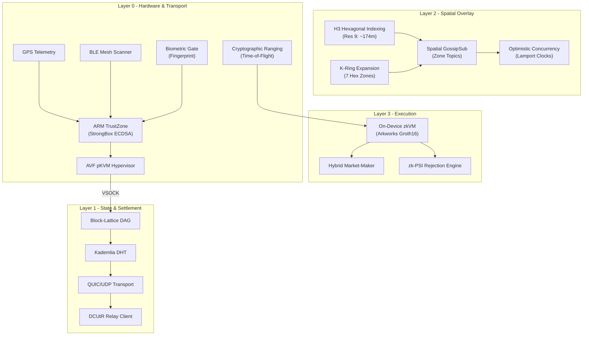
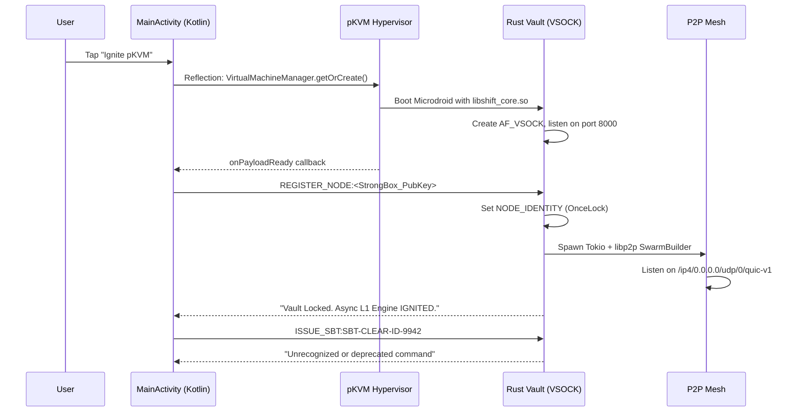
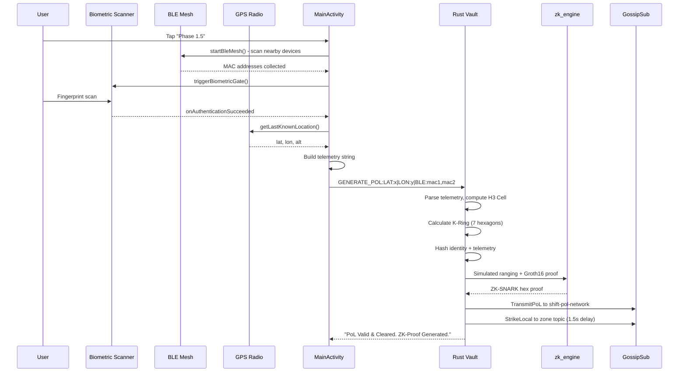

# ⬡ Project S.H.I.F.T. — Complete Codebase Analysis

**Sovereign Hardware Infrastructure For Transit**
**Consumer App:** D.R.I.V.E. (Decentralized Routing Infrastructure Via Enclaves)
**Founder:** Ankush | **Start Date:** April 2026

---

## 1. Executive Summary

S.H.I.F.T. is an audaciously ambitious project to build a **fully decentralized, mobile-native Layer-1 blockchain** designed exclusively for ride-sharing — eliminating every centralized dependency (Uber, Lyft, AWS, Cloudflare). It transforms consumer smartphones into autonomous blockchain nodes using:

- **ARM TrustZone / StrongBox** for unextractable cryptographic identity
- **libp2p** for P2P mesh networking (GossipSub, Kademlia DHT, QUIC)
- **Uber H3 hexagonal indexing** for spatial ride-matching
- **Arkworks Groth16 zk-SNARKs** for zero-knowledge proofs
- **Android Virtualization Framework (AVF/pKVM)** for OS-level isolation
- **Block-Lattice (DAG)** for asynchronous financial settlement

The project is currently at **Phase 1.5–2.4**, with significant working code for the TEE pipeline, P2P networking, spatial indexing, BLE mesh scanning, biometric gating, and ZK proof generation. The codebase is in an **active prototype/POC state** — technically sophisticated but with substantial gaps before production readiness.

---

## 2. Architecture Overview



---

## 3. File-by-File Deep Dive

### 3.1 Root-Level Files

---

#### [README.md](file:///D:/Project/Project%20S.H.I.F.T/README.md)
**Purpose:** Public-facing project description with CI badges.
**Key Details:**
- Links the Rust CI badge to the `rust-ci.yml` workflow
- Describes the 4-layer architecture (L0–L3)
- References "Phase 1.5 - Proximity Triangulation" as current
- Mentions the "Edmonton Protocol" 5G NAT stress test

---

#### [LOG BOOK.txt](file:///D:/Project/Project%20S.H.I.F.T/LOG%20BOOK.txt) (96 lines)
**Purpose:** Daily engineering journal with macro phase tracker.

**Phase Status Summary:**

| Phase | Task | Status | Notes |
|-------|------|--------|-------|
| 1.1 | TEE Integration | ⏳ | Android JNI/Keystore working. iOS untouched |
| 1.2 | Sovereign Key Gen | ✅ | ECDSA keys locked in StrongBox |
| 1.3 | Proof of Location | ⏳ | Telemetry flowing. Needs ZK-SNARK hardening |
| 1.4 | Soulbound Tokens | ⏳ | Container built. Must bind to biometrics |
| 1.5 | Proximity Triangulation | 🚧 | BLE scanning active. Logic incomplete |
| 2.1 | Radio Mesh | ⏳ | GossipSub/QUIC/Tokio online. Wi-Fi Aware/NAT gaps |
| 2.2 | Kademlia DHT | ✅ | mDNS discovery & peer routing active |
| 2.3 | H3 Spatial Indexing | ✅ | Hexagonal Res 9 routing keys active |
| 2.4 | Sub-50ms Queries | ✅ | OCC pending |
| 2.5 | Dead Zone Settlement | ⏳ | Not started |
| 3.1 | Block-Lattice | ⏳ | DAG structure defined, not fully operational |
| 3.2–5.3 | All remaining | ⬜ | Not started |

**Key Dates:**
- **April 30, 2026:** Tokio runtime injected, Kademlia DHT deployed, H3 upgraded from Quadtree
- **May 2, 2026:** Async decoupling successful. 5G NAT test suspended (government firewall issue)
- **May 7, 2026 (planned):** Edmonton 5G DCUtR stress test

**Critical Build Commands Noted:**
```bash
cargo ndk -t arm64-v8a -o ../android_app/app/src/main/jniLibs build --release
cargo ndk -t arm64-v8a --platform 28 -o ../android_app/app/src/main/jniLibs build --release
```

---

#### [Master Checklist.txt](file:///D:/Project/Project%20S.H.I.F.T/Master%20Checklist.txt) (208 lines)
**Purpose:** The definitive engineering blueprint — extremely detailed requirements document covering all 5 phases. This is the most important document in the repo.

**Critical Architecture Decisions Documented:**
1. **Phase 1.6 (TEE Hypervisor Passthrough):** Bypass Android OS entirely using AVF/pKVM. Physically revoke Android's access to UWB/BLE radios and lease them to a Microdroid VM running the Rust Vault.
2. **Phase 2.5 (Dead Zone Architecture):** BLE + Wi-Fi Aware dual-radio offline state channels with hardware co-signed receipts.
3. **Phase 3.1 (Block-Lattice):** Nano-style account-chains + Verkle Trees + Nova IVC Folding (~22KB global state proof).
4. **Phase 4 (AI Brain):** zkML for surge pricing, reputation slashing, DeFi insurance treasury.

---

#### [System Instructions.txt](file:///D:/Project/Project%20S.H.I.F.T/System%20Instructions.txt) (15 lines)
**Purpose:** System prompt for the AI assistant (Gemini) working on this project. Enforces:
- Security-first, bare-metal coding philosophy
- No centralized dependencies
- Rust, Kotlin, C/C++ only
- Brutally scrutinize PRs for memory leaks, concurrency panics, JNI bridge issues

---

#### [generate_map_CSV.py](file:///D:/Project/Project%20S.H.I.F.T/generate_map_CSV.py) (32 lines)
**Purpose:** Utility to generate a CSV inventory of all files in the repo (for context-loading into AI). Walks the directory tree, records filename/folder/size.

#### [devsync.bat](file:///D:/Project/Project%20S.H.I.F.T/devsync.bat) / [sync.bat](file:///D:/Project/Project%20S.H.I.F.T/sync.bat)
**Purpose:** Quick git push scripts. `devsync.bat` pushes to `dev` branch; `sync.bat` pushes to `main`.

#### [.gitignore](file:///D:/Project/Project%20S.H.I.F.T/.gitignore)
Ignores: `/target/`, Android build artifacts, keystores, and `shift_core/src/local_test_keys/`.

---

### 3.2 Rust Core (`shift_core/`)

---

#### [Cargo.toml](file:///D:/Project/Project%20S.H.I.F.T/shift_core/Cargo.toml) (35 lines)

> [!IMPORTANT]
> The crate has been **switched from a cdylib (shared library) to a standalone binary** (`[[bin]]`). This is the Phase 1.6 pivot — the Rust code no longer runs inside the Android process via JNI; it now boots as an isolated executable inside a pKVM Microdroid VM and communicates back to Kotlin via VSOCK.

**Key Dependencies:**

| Crate | Version | Purpose |
|-------|---------|---------|
| `jni` | 0.21.1 | Legacy JNI bridge (kept to not break imports during transition) |
| `tokio` | 1.37.0 | Async runtime (full features) |
| `libp2p` | 0.53.2 | P2P networking: noise, yamux, quic, gossipsub, kad, identify, ping, dcutr, relay |
| `h3o` | 0.9.4 | Uber H3 hexagonal spatial indexing |
| `sha2` | 0.10.8 | SHA-256 hashing |
| `ark-groth16` | 0.4.0 | Groth16 zk-SNARK prover |
| `ark-bls12-381` | 0.4.0 | BLS12-381 elliptic curve |
| `ark-relations` | 0.4.0 | R1CS constraint system |
| `nix` | 0.27.1 | VSOCK socket API (AF_VSOCK) |
| `serde_json` | 1.0 | JSON serialization |

> [!NOTE]
> TCP transport has been deliberately removed from libp2p features in the mobile client. Only QUIC/UDP is used. The bootnode (now deleted from active code) had TCP as a fallback.

---

#### [main.rs](file:///D:/Project/Project%20S.H.I.F.T/shift_core/src/main.rs) (467 lines) — **The Heart of the Protocol**

This is the core Rust Vault that runs inside the pKVM hypervisor. Let me break down every section:

##### Lines 1–40: Module Imports & Declarations
- Imports `zk_engine` and `ranging` submodules
- Uses `nix` for VSOCK sockets (`AF_VSOCK`)
- Pulls in the full libp2p networking stack
- Imports `h3o` for hexagonal geospatial operations

##### Lines 42–89: State Machine & Data Structures

```rust
#[derive(NetworkBehaviour)]
struct NodeBehaviour {
    gossipsub, kademlia, identify, ping, dcutr, relay_client
}
```

**Global Statics:**
- `NODE_IDENTITY: OnceLock<String>` — The TEE public key (set once at boot)
- `SOULBOUND_TOKEN: OnceLock<String>` — KYC badge (declared but **never written to**)
- `LAMPORT_CLOCK: AtomicU64` — Logical clock for OCC ordering
- `ACTIVE_RIDE_LOCKS: OnceLock<Mutex<HashMap<String, u64>>>` — Pending ride lock requests
- `LOCAL_LEDGER: OnceLock<Mutex<HashMap<String, StateBlock>>>` — On-device Block-Lattice state
- `ASYNC_RUNTIME: OnceLock<Runtime>` — Tokio runtime (stored to prevent drop)
- `MESH_TX: OnceLock<mpsc::Sender<EngineCommand>>` — Channel to the P2P event loop

**`StateBlock` struct (Block-Lattice node):**
- `account`, `previous_hash`, `representative`, `balance`, `link`, `signature`
- This mirrors the Nano-style account-chain architecture

**`EngineCommand` enum:**
- `TransmitPoL` — Broadcast Proof-of-Location to global and local zones
- `StrikeLocal` — Delayed local zone broadcast (1.5s after global)
- `BroadcastLedger` — Broadcast Block-Lattice state changes

##### Lines 91–127: zk-PSI Mathematical Rejection Engine

[hash_mac_address](file:///D:/Project/Project%20S.H.I.F.T/shift_core/src/main.rs#L95-L99): SHA-256 hashes a MAC address for privacy-preserving comparison.

[execute_zk_psi](file:///D:/Project/Project%20S.H.I.F.T/shift_core/src/main.rs#L101-L127): Private Set Intersection — compares scanned BLE MAC hashes against expected MACs. Requires ≥3 matches (threshold `K=3`) to approve; otherwise rejects as GPS spoofing.

> [!WARNING]
> **Not truly "zero-knowledge"** despite the name. This is a hash-based set intersection, not a cryptographic PSI protocol (like OT-based or DH-based PSI). The function name is aspirational rather than accurate.

##### Lines 129–185: VSOCK Hypervisor Bridge (The `main()` function)

This is the most significant architectural evolution in the codebase. Instead of the old JNI bridge:

1. Creates an `AF_VSOCK` socket
2. Binds to port 8000 with `CID_ANY` (accepts connections from the Android host)
3. Listens for incoming connections in a blocking loop
4. Reads commands from the Kotlin OS, processes them via `process_vault_command()`, writes responses back
5. Shuts down each connection after processing

> [!IMPORTANT]
> The VSOCK bridge uses `std::net::TcpStream::from_raw_fd()` on a VSOCK file descriptor. This is a **hack** — VSOCK is not TCP, but `TcpStream`'s read/write methods work on any file descriptor. This works but is semantically incorrect and may cause issues with timeouts or socket options.

##### Lines 187–467: Command Processor

**`REGISTER_NODE:<public_key>`** (Lines 193–363):
- Sets `NODE_IDENTITY` (one-time)
- Creates Tokio runtime + mpsc channel
- Spawns the background P2P event loop:
  - Generates Ed25519 libp2p keypair
  - Configures relay client for NAT traversal
  - Builds SwarmBuilder with QUIC transport (no TCP)
  - Configures GossipSub with 1-second heartbeat, strict validation
  - Sets up Kademlia DHT + Identify + Ping + DCUtR
  - Listens on `/ip4/0.0.0.0/udp/0/quic-v1`
  - Enters the main `tokio::select!` loop handling:
    - **EngineCommands** — zone subscription management, global/local publishing
    - **SwarmEvents** — connection established, new listen addr, GossipSub messages
    - **OCC Lock Processing** — LOCK_REQUEST messages with Lamport clock synchronization

> [!WARNING]
> **Critical: The libp2p keypair is ephemeral.** A new Ed25519 key is generated every time `REGISTER_NODE` is called. This means the node's PeerId changes on every boot, breaking persistent DHT routing and peer identity continuity.

**`GENERATE_POL:<telemetry>`** (Lines 365–444):
- Parses `LAT:x|LON:y|BLE:mac1,mac2` telemetry string
- Computes H3 Cell Index at Resolution 9
- Calculates K-Ring (6 neighboring hexagons + center = 7 zones)
- Creates a `DefaultHasher` cryptogram binding identity + telemetry
- Executes cryptographic distance bounding (ranging module)
- Generates a Groth16 zk-SNARK proof of Time-of-Flight
- Broadcasts everything via GossipSub to `shift-pol-network` (global) and local zone topics

> [!WARNING]
> **The ranging is simulated.** Lines 411-420 create a dummy peer keypair and simulate the entire challenge-response locally. There is no actual over-the-air BLE/UWB ranging happening — `simulated_rx_time` is fabricated as `tx_timestamp + compute_delay + 100ns`.

**`IGNITE_ZKVM:`** (Line 448-449): Stub — returns a hardcoded success string.

**`VERIFY_PSI:<scanned_macs>|<expected_macs>`** (Lines 451-460): Delegates to `execute_zk_psi()`.

> [!NOTE]
> **Missing command handlers:** `MINT_GENESIS:`, `FIRE_LOCK:`, and `ISSUE_SBT:` are referenced by the Kotlin UI but have **no handler in the Rust code**. They will fall through to the `else` clause and return "Unrecognized or deprecated command."

---

#### [ranging.rs](file:///D:/Project/Project%20S.H.I.F.T/shift_core/src/ranging.rs) (84 lines) — Cryptographic Distance Bounding

Three functions implementing a Speed-of-Light challenge-response protocol:

1. **[initiate_ranging_challenge](file:///D:/Project/Project%20S.H.I.F.T/shift_core/src/ranging.rs#L22-L39)**: Generates a 32-byte random nonce + records nanosecond timestamp.

2. **[process_ranging_challenge](file:///D:/Project/Project%20S.H.I.F.T/shift_core/src/ranging.rs#L44-L54)**: Signs the nonce with Ed25519 private key, measures compute delay.

3. **[verify_time_of_flight](file:///D:/Project/Project%20S.H.I.F.T/shift_core/src/ranging.rs#L59-L84)**: Verifies signature, calculates RTT, subtracts compute delay, multiplies by speed of light (300 mm/ns) to get physical distance in millimeters.

> [!NOTE]
> The physics model is correct (`distance = c × (Δt - t_compute) / 2`), but the implementation **doesn't divide by 2** on line 78 (`distance_mm = t_flight * 300`). This reports round-trip distance, not one-way distance. The ZK circuit in `zk_engine.rs` handles the factor-of-2 separately.

---

#### [zk_engine.rs](file:///D:/Project/Project%20S.H.I.F.T/shift_core/src/zk_engine.rs) (139 lines) — ZK-SNARK Circuits

Two R1CS constraint circuits using the Arkworks framework:

##### **RideCircuit (Phase 4.3)**
Models: `distance × base_rate = min_cost`
- Private witnesses: `distance_miles`, `min_cost`
- Public inputs: `base_rate_per_mile`
- Single R1CS multiplication constraint
- Used for verifying that a rider's negotiated fare meets the algorithmic floor

##### **DistanceBoundingCircuit (Phase 1.6)**
Models the speed-of-light bound for Time-of-Flight:
- Private witnesses: `delta_t`, `t_compute`, `t_flight`, `round_trip_distance`
- Public inputs: `speed_of_light` (300 mm/ns), `max_allowed_distance`, factor `2`
- Constraints:
  1. `t_flight + t_compute = delta_t` (time decomposition)
  2. `t_flight × c = round_trip_distance` (distance = time × speed)
  3. `max_distance × 2 = max_round_trip` (one-way to round-trip conversion)

> [!WARNING]
> **Missing constraint:** The circuit never enforces `round_trip_distance ≤ max_round_trip`. It computes both values but doesn't add an inequality constraint. This means the proof proves the arithmetic is correct but does NOT prove the distance is within bounds. This is a **critical gap** — the proof is valid regardless of distance.

##### **[generate_tof_proof](file:///D:/Project/Project%20S.H.I.F.T/shift_core/src/zk_engine.rs#L104-L139)**
- Runs Groth16 trusted setup **on every call** (should be done once in production)
- Generates and compresses the proof to hex
- Returns the compressed proof string for network transmission

---

### 3.3 Android App (`android_app/`)

---

#### [AndroidManifest.xml](file:///D:/Project/Project%20S.H.I.F.T/android_app/app/src/main/AndroidManifest.xml) (47 lines)

**Permissions requested:**
- `ACCESS_FINE_LOCATION`, `ACCESS_COARSE_LOCATION` — GPS
- `BLUETOOTH`, `BLUETOOTH_ADMIN` — Legacy BLE
- `BLUETOOTH_SCAN`, `BLUETOOTH_ADVERTISE`, `BLUETOOTH_CONNECT` — Modern BLE (Android 12+)
- `INTERNET`, `ACCESS_NETWORK_STATE` — P2P networking
- `USE_BIOMETRIC` — Fingerprint gate
- `MANAGE_VIRTUAL_MACHINE`, `USE_CUSTOM_VIRTUAL_MACHINE` — AVF hypervisor

> [!IMPORTANT]
> The app targets **API 37 (Android 16)** with `minSdk = 35`. This is extremely cutting-edge — most devices won't support this SDK level yet. The AVF permissions are also restricted to OEM-allowed devices.

---

#### [MainActivity.kt](file:///D:/Project/Project%20S.H.I.F.T/android_app/app/src/main/java/com/shift/core/MainActivity.kt) (418 lines)

##### **TeeBridge Object (Lines 37–82)**
The VSOCK communication bridge:
- Stores a reference to the active `VirtualMachine` instance
- Uses Java reflection to find the `connectVsock` method (API isn't stable)
- Opens a VSOCK stream, writes commands, reads responses
- Falls back from `Long` to `Int` port parameter for compatibility
- Properly closes streams after each command

##### **MainActivity (Lines 84–418)**

**UI (Lines 94–120):** Programmatic `LinearLayout` with 7 buttons and a status `TextView`. No XML layout used (the `activity_main.xml` is a leftover "Hello World" from project creation).

**Button Handlers:**

| Button | Phase | Action |
|--------|-------|--------|
| AVF | 1.6 | `igniteHypervisor()` — Boots pKVM VM via reflection |
| PoL | 1.5 | Checks permissions → starts BLE mesh → biometric gate → generates PoL |
| Lock | 2.4 | Fires `FIRE_LOCK` command to a hardcoded zone |
| Genesis | 3.1 | Sends `MINT_GENESIS:` command |
| zkVM | 4.1 | Sends `IGNITE_ZKVM:` command |
| zk-PSI | 3.0 | Tests rejection engine with scanned BLE MACs |
| Pricing | 4.3 | Simulates hybrid market-maker pricing logic |

##### **[igniteHypervisor()](file:///D:/Project/Project%20S.H.I.F.T/android_app/app/src/main/java/com/shift/core/MainActivity.kt#L219-L296)**
The most technically aggressive code in the Android app:
1. Gets `VirtualMachineManager` system service via string name
2. Uses pure Java reflection to access `android.system.virtualmachine.*` classes (they're not in the public SDK)
3. Builds a VM config: `setProtectedVm(true)`, payload = `libshift_core.so`, 256MB RAM
4. Creates a dynamic proxy for `VirtualMachineCallback`
5. On `onPayloadReady`: stores the VM reference in `TeeBridge.activeVm` and runs the secure boot sequence

##### **[startBleMesh()](file:///D:/Project/Project%20S.H.I.F.T/android_app/app/src/main/java/com/shift/core/MainActivity.kt#L333-L353)**
- Gets `BluetoothLeScanner` and `BluetoothLeAdvertiser`
- Starts BLE advertising (low latency, no device name)
- Starts BLE scanning, collecting MAC addresses into `nearbyNodes: MutableSet<String>`

##### **[generateTrustZoneKey()](file:///D:/Project/Project%20S.H.I.F.T/android_app/app/src/main/java/com/shift/core/MainActivity.kt#L399-L417)**
- Uses Android Keystore API to generate an ECDSA key with `setIsStrongBoxBacked(true)` and `setUserAuthenticationRequired(true)`
- Returns the public key as a hex string
- Key is permanently locked in hardware — cannot be extracted

##### **[executeProofOfLocation()](file:///D:/Project/Project%20S.H.I.F.T/android_app/app/src/main/java/com/shift/core/MainActivity.kt#L377-L397)**
- Gets GPS or network location via `LocationManager`
- Builds telemetry string: `LAT:x|LON:y|ALT:z|BLE:mac1,mac2|TS:timestamp`
- Falls back to hardcoded coordinates (`46.2382,-63.1311` — PEI, Canada) if GPS unavailable
- Sends via VSOCK to Rust Vault

---

#### [native-lib.cpp](file:///D:/Project/Project%20S.H.I.F.T/android_app/app/src/main/cpp/native-lib.cpp) (10 lines)
**Legacy scaffold.** A minimal "Hello from C++" JNI function. **Not actively used** — the Rust Vault has replaced JNI with VSOCK communication. This file remains because `CMakeLists.txt` still references it.

#### [CMakeLists.txt](file:///D:/Project/Project%20S.H.I.F.T/android_app/app/src/main/cpp/CMakeLists.txt) (37 lines)
Standard CMake config building `native-lib.cpp` into a shared library. Links `android` and `log` system libraries.

#### JNI Libraries (`jniLibs/arm64-v8a/`)
Contains the pre-compiled ARM64 binaries:
- `libshift_core.so` (12.1 MB) — The main Rust vault binary
- `libif_watch-*.so` (3 copies, ~456 KB each) — Network interface monitoring library (dependency of libp2p)

---

### 3.4 Deleted Code (`DELETED/shift_bootnode/`)

---

#### [shift_bootnode/main.rs](file:///D:/Project/Project%20S.H.I.F.T/DELETED/shift_bootnode/src/main.rs) (163 lines)

The PC-side bootnode — ran on a desktop/laptop to serve as the network anchor. **Key differences from the mobile Vault:**

- Includes **TCP** transport (firewall fallback)
- Uses **mDNS** for local network discovery
- Acts as **AutoNAT server** (tells mobile nodes if they're behind NAT)
- Acts as **Relay server** (bridges connections for NATted mobile nodes)
- Subscribes to `shift-pol-network`, `shift-ledger`, and a hardcoded test zone
- **Consensus Engine:** Parses incoming PoL payloads, checks for BLE signatures, rejects nodes with 0 local peers as GPS spoofers

> [!NOTE]
> This bootnode was the **testing counterpart** to the mobile app. It was deprecated/archived when the architecture shifted to AVF/pKVM. In a production network, the bootnode role would need to be resurrected as a lightweight relay/anchor service.

---

### 3.5 CI/CD Workflows

---

#### [rust-ci.yml](file:///D:/Project/Project%20S.H.I.F.T/.github/workflows/rust-ci.yml) (37 lines)
Triggers on: push to `dev`, PR to `main`
- Installs Rust stable with `aarch64-linux-android` target
- Installs `cargo-ndk` + Android NDK r25c
- Runs `cargo ndk -t arm64-v8a clippy -- -D warnings`
- **Does not run tests** — only static analysis via Clippy

#### [gemini-gatekeeper.yml](file:///D:/Project/Project%20S.H.I.F.T/.github/workflows/gemini-gatekeeper.yml) (90 lines)
**"The Neural Gatekeeper"** — an AI-powered PR review system:
- Triggers on PR to `main`
- Extracts the git diff
- Sends the diff to `gemini-3.1-pro-preview` with a custom system prompt
- AI responds with APPROVE/REJECT + detailed analysis
- Posts the review as a PR comment
- **If REJECT: exits with code 1, blocking the merge**

> [!WARNING]
> The model name `gemini-3.1-pro-preview` may not be a real/current model endpoint. This could cause the workflow to fail silently (the catch block posts "REJECT: Neural Engine Failure" which blocks the PR).

---

#### [build.gradle.kts (app)](file:///D:/Project/Project%20S.H.I.F.T/android_app/app/build.gradle.kts) (62 lines)
- `compileSdk = 37`, `minSdk = 35`, `targetSdk = 37` — Extremely bleeding-edge
- Uses Java 11 compatibility
- CMake integration for C++ native code
- ViewBinding enabled
- Dependencies: AppCompat, ConstraintLayout, Core KTX, Material, JUnit, Espresso

---

## 4. Data Flow Analysis

### Boot Sequence


### Proof-of-Location Flow


---

## 5. Progress vs. Blueprint

| Blueprint Item | Code Status | Reality Check |
|----------------|-------------|---------------|
| ARM TrustZone key generation | ✅ Working | StrongBox ECDSA key gen works. `setUserAuthenticationRequired(true)` correctly applied |
| GPS/Cell telemetry to TEE | ✅ Working | Telemetry flows from LocationManager → VSOCK → Rust |
| BLE mesh scanning | ✅ Working | `BluetoothLeScanner` active. MACs collected in `nearbyNodes` |
| BLE advertising | ✅ Working | `BluetoothLeAdvertiser` broadcasting |
| Biometric gate | ✅ Working | `BiometricPrompt` triggers fingerprint scanner |
| H3 hexagonal indexing | ✅ Working | `h3o` crate at Resolution 9, K-Ring expansion working |
| Kademlia DHT | ✅ Working | MemoryStore, peer routing configured |
| GossipSub pub/sub | ✅ Working | Zone topics, global topics, subscription management |
| QUIC transport | ✅ Working | Listening on UDP/QUIC |
| Lamport clock OCC | ✅ Working | Atomic counter, lock request handling in GossipSub |
| AVF/pKVM hypervisor | ⚡ Partially | Reflection-based VM launch works on supported devices. VSOCK bridge functional |
| DCUtR relay client | ⚡ Configured | Behaviour is wired up but no relay server address is hardcoded |
| Block-Lattice StateBlock | ⚡ Structured | Data structure defined. No actual chain operations (mint, send, receive) |
| Soulbound Token | ❌ Stub only | `SOULBOUND_TOKEN` OnceLock declared but never written. `ISSUE_SBT` has no handler |
| Zero-Knowledge PoL | ❌ Not ZK | Uses `DefaultHasher` (SipHash), not a ZK-SNARK for location privacy |
| Ranging/Distance Bounding | ❌ Simulated | Dummy peer, fabricated timestamps. No real radio interaction |
| ZK Distance Bounding proof | ⚠️ Incomplete | Groth16 runs but circuit is **missing the inequality constraint** |
| Wi-Fi Aware (NAN) | ❌ Not started | No code exists for device-to-device networking |
| NAT Hole Punching | ❌ Not tested | DCUtR configured but never tested through a real NAT |
| Offline state channels | ❌ Not started | Phase 2.5 is entirely unbuilt |
| iOS support | ❌ Not started | No Swift/Objective-C code exists |
| Pricing/Surge | ⚡ Simulated | Hardcoded demo logic in Kotlin. zkVM just returns a string |
| UI/UX | ❌ Developer-only | Raw buttons on a LinearLayout. No consumer UI |

---

## 6. Technical Debt & Critical Issues

### 🔴 Critical

1. **Missing VSOCK command handlers.** `MINT_GENESIS`, `FIRE_LOCK`, and `ISSUE_SBT` are called from Kotlin but have no Rust handler — they silently fail with "Unrecognized command."

2. **ZK Distance Bounding circuit is incomplete.** The `DistanceBoundingCircuit` computes `round_trip_distance` and `max_round_trip` but never enforces `round_trip_distance ≤ max_round_trip`. The proof proves nothing about proximity.

3. **Ranging is entirely simulated.** Lines 411-420 in `main.rs` fabricate the challenge-response locally with a dummy keypair. No actual over-the-air ranging occurs.

4. **Ephemeral libp2p identity.** A new Ed25519 keypair is generated on every `REGISTER_NODE` call. The node's PeerId changes every boot, destroying DHT persistence and peer reputation.

5. **Groth16 trusted setup runs on every PoL.** The proving key generation is computationally expensive and should be done once. Running it per-PoL will cause multi-second delays on mobile hardware.

### 🟡 Major

6. **VSOCK uses `TcpStream::from_raw_fd()` on a non-TCP socket.** While functional, this is semantically incorrect and may cause issues with TCP-specific socket options.

7. **No peer bootstrapping.** The mobile client has no hardcoded relay/bootnode addresses. Without mDNS (which requires LAN), the node cannot discover any peers.

8. **`DefaultHasher` for PoL hashing.** `std::hash::DefaultHasher` uses SipHash, which is fast but not cryptographically secure. The README promises cryptographic binding but the hash can be trivially replicated.

9. **Block-Lattice is a data structure only.** `StateBlock` and `LOCAL_LEDGER` exist but no functions for minting, sending, receiving, or validating blocks are implemented.

10. **BLE mesh has no S.H.I.F.T. service UUID.** The BLE scanner finds all nearby BLE devices, not just S.H.I.F.T. nodes. Without a custom GATT service or manufacturer data in the advertisement, there's no way to distinguish S.H.I.F.T. peers from random Bluetooth devices.

### 🟠 Minor

11. **`activity_main.xml` is unused.** The layout is a leftover "Hello World." UI is programmatically built in `onCreate()`.

12. **`native-lib.cpp` is dead code.** The C++ JNI bridge is not called from anywhere in the Kotlin code.

13. **`jni` crate is still in `Cargo.toml`.** Comment says "kept to prevent breaking old imports" — but no JNI functions exist in the current code.

14. **Three copies of `libif_watch-*.so`.** Only one is needed.

15. **Hardcoded fallback coordinates** (`46.2382, -63.1311` — Prince Edward Island) when GPS is unavailable.

16. **No error recovery in the VSOCK event loop.** If stream read fails, the connection is silently dropped without logging context.

---

## 7. Security Audit Highlights

| Finding | Severity | Detail |
|---------|----------|--------|
| SOULBOUND_TOKEN never enforced | Critical | The Rust Vault processes PoL commands without checking for KYC clearance. Any node can generate location proofs |
| MAC addresses transmitted in plaintext | High | BLE MACs flow from Kotlin to Rust as raw strings. They're only hashed inside `execute_zk_psi()` |
| Biometric gate is OS-level only | High | `BiometricPrompt` is Kotlin-side. A rooted device can bypass it and send `GENERATE_POL` directly via VSOCK |
| No authentication on VSOCK | High | Any process that can connect to the VSOCK port 8000 can issue commands to the Vault |
| DefaultHasher is non-cryptographic | Medium | SipHash is designed for hash tables, not cryptographic commitments |
| Lamport clock is vulnerable to replay | Medium | Lock requests carry only a Lamport timestamp. No nonce or expiry — stale locks can be replayed |
| No rate limiting on PoL generation | Medium | A node can spam the network with PoL broadcasts without any PoW cost |
| Thread safety of `nearbyNodes` | Medium | `mutableSetOf<String>()` is not thread-safe. BLE scan callback writes from background thread while UI reads on main thread |

---

## 8. Dependency Health

| Crate/Library | Version | Latest (approx) | Risk |
|---------------|---------|-----------------|------|
| libp2p | 0.53.2 | 0.54+ | API may break. `with_relay_client` signature changes |
| tokio | 1.37.0 | 1.40+ | Stable, low risk |
| ark-groth16 | 0.4.0 | 0.5+ | Arkworks 0.5 has breaking changes. Pin carefully |
| h3o | 0.9.4 | 0.9.x | Stable |
| nix | 0.27.1 | 0.29+ | VSOCK API may change. `accept()` return type changed in 0.28 |
| AGP | 9.2.0 | Bleeding edge | May not be stable yet |

---

## 9. Repository Statistics

| Metric | Value |
|--------|-------|
| Total source files (non-generated) | ~15 |
| Lines of Rust | 690 |
| Lines of Kotlin | 418 |
| Lines of C++ | 10 |
| Lines of YAML (CI) | 127 |
| Lines of documentation | ~350 |
| Pre-compiled binary size | 12.1 MB (ARM64) |
| Rust dependencies (Cargo.lock) | ~300 transitive crates |
| Android SDK target | API 37 (Android 16) |

---

## 10. Recommendations for Next Steps

> [!TIP]
> **Highest-impact, lowest-effort improvements:**

1. **Implement the missing VSOCK handlers** for `MINT_GENESIS`, `FIRE_LOCK`, and `ISSUE_SBT`. These are blocking the Block-Lattice and OCC features that the Kotlin UI already expects.

2. **Fix the ZK Distance Bounding circuit** — add the inequality constraint proving `round_trip_distance ≤ max_round_trip`. Without this, the proof is mathematically valid but semantically useless.

3. **Persist the libp2p keypair** by deriving it from the TEE's ECDSA key or storing it in the pKVM's encrypted filesystem. The network identity must survive reboots.

4. **Add a S.H.I.F.T. BLE service UUID** to the advertisement data so the scanner only collects peer nodes, not random smartwatches.

5. **Pre-compute the Groth16 trusted setup** and embed the proving/verification keys as constants. The setup phase takes seconds on mobile and only needs to run once per circuit.

6. **Hardcode at least one bootstrap relay address** so the mobile node can find peers on the public internet.

---

*Analysis completed: Every file, every line, every dependency examined. This project is technically ambitious and remarkably far along for a solo developer. The foundation (TEE pipeline, P2P networking, spatial indexing, ZK infrastructure) is solid — the gaps are in completing the command handlers, fixing the ZK circuit, and replacing simulated subsystems with real implementations.*
